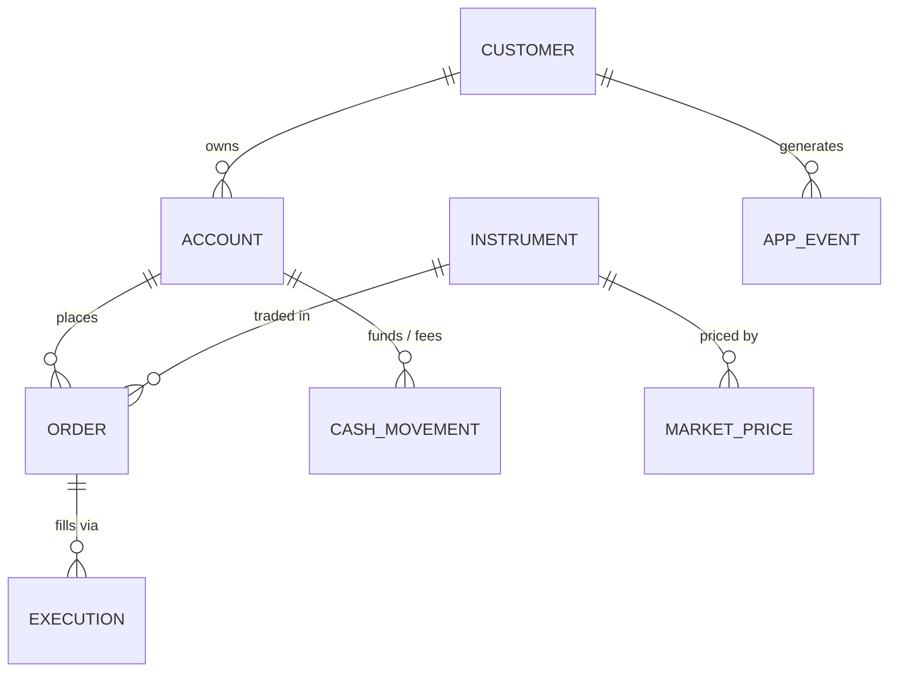

# tradeflow — Project Plan

> A local-first analytics engineering platform for a fictional retail brokerage.
> dbt + DuckDB + Dagster + Dash, with dimensional modeling, a tag-driven data
> classification & masking framework, data quality tests, CI/CD and Slack alerting.

**Status:** planning + v0.1 scaffold
**Owner:** josegalarza
**Repo:** `github.com/josegalarza/tradeflow`

---

## 1. Why this project exists

This is a portfolio repo. Its job is to let a reviewer — a hiring manager, a
staff data engineer, a recruiter skimming for keywords — reach a confident
judgement about my analytics engineering ability in under ten minutes, and to
verify that judgement by running one command.

That imposes three hard constraints that shape every decision below:

1. **Free and runnable by a stranger.** No cloud account, no API key, no
   warehouse credits. `make demo` must go from `git clone` to a populated
   warehouse and a running dashboard. Anything that requires a reviewer to pay
   or sign up is disqualified, no matter how good it looks on a résumé.
2. **Complete at every commit.** A half-built repo sitting public for six months
   reads worse than a small finished one. Every phase in §8 ends with a working
   system and an accurate README.
3. **Depth over breadth, but legible depth.** One well-modeled domain with real
   SCD2, real fact grains and a real governance layer beats six shallow demos.
   But the depth has to be *visible* — diagrams, generated docs, screenshots.

### Non-goals

- Not a real trading system. No order routing, no exchange connectivity, no
  financial advice. The domain is a vehicle for data modeling.
- Not a big-data benchmark. It scales to tens of millions of rows on a laptop,
  which is enough to make partitioning and incremental models *necessary*
  rather than decorative. It is not trying to prove anything about petabytes.
- Not a dbt tutorial. The README explains decisions and trade-offs, not syntax.

---

## 2. Stack and the reasoning behind it

| Concern | Choice | Why this and not the alternative |
|---|---|---|
| Warehouse | **DuckDB** | Real OLAP engine — columnar, vectorised, window functions, `QUALIFY`, Parquet-native. Runs in-process with zero setup, so CI and a reviewer's laptop use the identical engine. Postgres would misrepresent the workload; BigQuery/Snowflake cost money and can't run in public CI. |
| Transform | **dbt-core** | The dominant skill in the market and the thing most job descriptions name. Gives refs/lineage/tests/docs/snapshots/unit tests in one tool. Dataform was considered and rejected: it's BigQuery-bound, so it violates constraint #1. Recorded in `docs/adr/0002`. |
| Orchestration | **Dagster** | Asset-aware rather than task-aware, which matches how a warehouse actually thinks. First-class dbt integration (`dagster-dbt` maps each model to an asset), asset checks, declarative partitions/backfills, and a UI worth screenshotting. Airflow is more widely recognised but heavier locally and clunkier over dbt; noted as a possible parallel adapter in §9. |
| Ingestion | **Python generator → Parquet** | A `--scale` knob is the whole point: the same repo produces 5k rows for CI and 50M for a laptop stress test. Date-partitioned Parquet in a landing zone lets dbt sources read external files, which is how real lakehouse ingestion looks. |
| BI | **Plotly Dash** + static HTML export | Dash for the interactive local app; a CI-rendered static Plotly export to GitHub Pages so a reviewer sees charts *without* cloning. Free, and it makes the repo self-demonstrating. |
| CI/CD | **GitHub Actions** | Free for public repos, and the artifacts (dbt docs, coverage report, Pages site) become part of the portfolio rather than just passing checks. |
| Packaging | **Docker + compose** | One compose file brings up Dagster webserver, Dagster daemon and Dash. Proves the whole thing is reproducible off my machine. |

### On the data itself — stated plainly

The dataset is **synthetic**. Instrument reference data (symbols, names, sectors,
exchanges) is real-world; the price series are simulated with a
geometric-Brownian-motion walk from realistic starting prices, and all customer,
account, order and execution data is generated by
`ingestion/generate.py`. Nothing here is market data and the README says so in
the first paragraph.

This is a deliberate trade, not a shortcut. Synthetic data buys three things a
public dataset cannot:

- **A controllable PII surface.** Names, emails, phone numbers, dates of birth,
  national IDs, street addresses and IP addresses — the exact spread the
  classification and masking framework in §5 needs in order to be a real
  demonstration rather than a token one.
- **Volume control.** `--scale` changes row counts by four orders of magnitude
  without changing a single model.
- **Planted defects.** A `--inject-anomalies` flag deliberately introduces
  duplicate executions, orphan orders, negative quantities and late-arriving
  records, so the data quality tests in §6 have something real to catch and the
  Slack alerting in §7 has something real to fire on. Tests that never fail
  prove nothing.

---

## 3. Domain model

A fictional retail brokerage: customers open accounts, fund them, place orders
against instruments, orders fill via executions, positions accrue, and the
whole thing gets marked to market daily.



### Source tables (landing zone, Parquet)

| Source | Grain | Notes |
|---|---|---|
| `customers` | one row per customer, mutable | Heavy PII. Mutations over time drive SCD2. |
| `accounts` | one row per account | Types: cash / margin / retirement. |
| `instruments` | one row per instrument | Real symbols, sectors, exchanges, asset classes. |
| `orders` | one row per order, mutable status | Lifecycle: new → partially_filled → filled / cancelled / rejected. |
| `executions` | one row per fill | Many-per-order. Price, commission, venue, FX rate. |
| `cash_movements` | one row per movement | Deposits, withdrawals, fees, dividends, interest. |
| `market_prices` | one row per symbol per day | OHLCV + adjusted close. |
| `app_events` | one row per event | Logins, watchlist adds, order screens. Contains IP address and user agent. |

---

## 4. Warehouse architecture

Layered, with a rule enforced in CI: **a model may only reference the layer
immediately below it, plus its own layer.** Staging never joins. Marts never
read staging directly. This is checked by a script rather than by convention,
because conventions decay.

```
                 ┌──────────────────────────────────────────┐
  Parquet files  │  ingestion/generate.py  --scale --seed    │
  data/landing/  └──────────────────────────────────────────┘
        │
        ▼
  ┌─────────────────────────────────────────────────────────────────┐
  │ 10_staging       views · 1:1 with source · rename, cast, dedupe │
  │                  no joins, no business logic                    │
  │                  every column carries a classification tag      │
  ├─────────────────────────────────────────────────────────────────┤
  │ 20_intermediate  business logic · joins · fan-out resolution    │
  │                  ephemeral or views · never exposed to BI       │
  ├─────────────────────────────────────────────────────────────────┤
  │ 30_marts         dimensional · tables · the contract with BI    │
  │                  dims + facts, documented grain, contracts on   │
  ├─────────────────────────────────────────────────────────────────┤
  │ 40_secure        auto-generated masked views over 30_marts      │
  │                  one schema per role — see §5                   │
  └─────────────────────────────────────────────────────────────────┘
        │
        ▼
  Dash app  ·  static Plotly export  ·  dbt docs site
```

### Dimensional design (Kimball)

**Dimensions**

| Model | Type | Notes |
|---|---|---|
| `dim_date` | static spine | Calendar + fiscal + trading-day flags. |
| `dim_customer` | **SCD2** | From a dbt snapshot on the mutable customer source. Surrogate key, `valid_from` / `valid_to` / `is_current`. Tracks KYC status and risk rating changes over time — the thing SCD2 exists for. |
| `dim_account` | SCD1 + status | Degenerate hierarchy to customer. |
| `dim_instrument` | SCD1 | Sector / asset class / exchange, used as conformed dimension. |

**Facts** — deliberately one of each Kimball grain, because knowing the
difference is the actual skill:

| Model | Grain | Fact type |
|---|---|---|
| `fct_executions` | one row per fill | **Transaction** — additive measures: quantity, notional, commission. |
| `fct_orders` | one row per order | **Accumulating snapshot** — milestone timestamps (placed → first fill → final fill / cancel) plus lag measures. Updated as the order progresses. |
| `fct_positions_daily` | account × instrument × day | **Periodic snapshot** — running quantity, cost basis, market value, unrealised P&L. Incremental. |
| `fct_account_daily` | account × day | **Periodic snapshot** — cash, equity, net deposits, realised P&L. |

Plus two aggregate marts serving the dashboard directly
(`agg_daily_trading_activity`, `agg_customer_performance`) so the BI layer never
scans the atomic facts.

### Conventions

- Surrogate keys via `dbt_utils.generate_surrogate_key`, never raw natural keys
  in facts.
- Every fact declares its grain in a `uniqueness` test — no exceptions.
- `_loaded_at` / `_dbt_run_id` audit columns on staging.
- Model **contracts** (enforced types + not-null) on all of `30_marts`, so a
  breaking change fails at build time instead of in the dashboard.

---

## 5. Data classification & masking framework

The part of this repo I most want a reviewer to look at, because almost no
portfolio project has one.

### The mechanism

Every column in staging carries governance metadata in its schema YAML:

```yaml
- name: email
  description: Primary contact email.
  meta:
    classification: restricted     # public | internal | confidential | restricted
    pii: true
    pii_type: email
    masking: hash                  # none | hash | partial | redact | tokenize | generalize
```

From that, three things are generated — all from dbt's `manifest.json`, so the
tags are the single source of truth:

1. **Masked view generation.** `governance/generate_secure_views.py` emits one
   schema per role (`analyst`, `support`, `marketing`, `auditor`) containing a
   view over every mart, with each column rewritten according to the role's
   clearance and the column's `masking` strategy. An `analyst` sees
   `md5(email)`; `support` sees `j***@example.com`; `marketing` doesn't get the
   column at all. The masking functions live in a dbt macro so the same logic is
   testable.
2. **A classification coverage gate in CI.** Any column in staging or marts
   lacking a `classification` tag fails the build. This is the piece that makes
   the framework real: it cannot rot, because a new untagged column breaks the
   PR. Coverage percentage is reported as a CI summary.
3. **A generated data catalog.** `docs/catalog.md` plus a Dash page: every
   column, its classification, its masking strategy, its lineage, and which
   roles can see it. Reviewers can read the governance posture without reading
   SQL.

### What this deliberately does not claim

DuckDB has no native row-level security or dynamic data masking. This framework
*simulates* policy enforcement at the modeling layer — generated views plus role
schemas — and the README says exactly that, alongside a short note on how the
same tag metadata would drive Snowflake masking policies or BigQuery policy
tags. Being precise about the boundary is more impressive than overclaiming.

---

## 6. Data quality

Four tiers, escalating in cost and specificity:

1. **Schema tests** — `not_null`, `unique`, `relationships`, `accepted_values`
   on every model. Table stakes.
2. **`dbt-utils` / `dbt-expectations`** — expression-level: `expect_column_sum_to_equal`,
   row-count parity between layers, `mutually_exclusive_ranges` on SCD2 validity
   windows.
3. **Singular tests** — the domain-specific invariants that actually matter:
   - total executed quantity never exceeds its order's quantity
   - no execution timestamp precedes its order's `placed_at`
   - `fct_positions_daily` reconciles to the cumulative sum of `fct_executions`
   - SCD2 validity windows per customer are contiguous and non-overlapping
   - cash balance never goes negative on a cash (non-margin) account
4. **dbt unit tests** — fixed inputs, asserted outputs, on the genuinely tricky
   logic: position running-balance windowing, FX conversion, accumulating
   snapshot milestone resolution. These run without touching the warehouse.

Plus **source freshness** checks, and **Dagster asset checks** that block
downstream materialisation on failure rather than merely reporting.

Test severity is tiered: `error` on invariants, `warn` on distributional drift,
so the build signal stays meaningful.

---

## 7. Orchestration and notifications

Dagster, with the dbt project mapped asset-by-asset via `dagster-dbt` so the
lineage graph in the UI is the real model graph, not one opaque "run dbt" box.

- **Assets:** `landing_parquet` (generator) → dbt asset graph → `secure_views`
  → `static_dashboard_export`.
- **Partitions:** daily partitions on the landing and snapshot-fact assets, with
  backfill support — demonstrated in the README with a screenshot of a
  multi-day backfill.
- **Asset checks:** dbt tests surfaced as Dagster asset checks.
- **Schedules + sensors:** a daily schedule, plus a sensor that reacts to new
  Parquet files landing.
- **Slack:** a run-failure hook and a post-build summary (models built, tests
  passed/failed/warned, freshness, row counts). Configured by
  `SLACK_WEBHOOK_URL`; when unset it degrades to structured stdout logging so
  the repo still runs for anyone who clones it. The `--inject-anomalies` flag
  gives a one-command way to actually see an alert fire.

---

## 8. Delivery phases

Each phase ends with a green CI, an accurate README, and a git tag.

| Phase | Ships | Definition of done |
|---|---|---|
| **v0.1 Foundation** | Generator, dbt+DuckDB project, staging layer, `dim_date`, core dims, `fct_executions`, `fct_orders`, schema tests, Makefile, CI running `dbt build` | `make demo` works from a clean clone; CI green |
| **v0.2 Modeling depth** | SCD2 snapshot → `dim_customer`, `fct_positions_daily`, `fct_account_daily`, aggregates, incremental models, contracts, singular + unit tests, dbt docs to Pages | Every fact grain tested; docs site live |
| **v0.3 Governance** | Classification tags across all layers, masking macros, secure view generation, CI coverage gate, generated catalog | Untagged column fails CI; four role schemas materialise |
| **v0.4 Orchestration** | Dagster assets, partitions, asset checks, schedule, sensor, Slack hooks | Backfill demonstrated; alert fires on injected anomaly |
| **v0.5 Visualization** | Dash multi-page app (overview, customers, instruments, data quality, catalog), static export to Pages | Pages site shows live charts to a non-cloner |
| **v0.6 Ops polish** | Dockerfile, compose, GHCR release workflow, dbt Slim CI via stored manifest, ADRs, README screenshots/GIF | `docker compose up` brings up the full stack — files written in v0.1, but NOT yet verified (see README limitations) |

Anything in §9 is explicitly *out* until v0.6 ships.

---

## 9. Deferred ideas

Written down so they stop occupying attention:

- A parallel Airflow DAG demonstrating orchestrator-agnostic design.
- Streaming ingestion (Kafka/Redpanda) for `app_events`.
- Iceberg or Delta table format on the landing zone.
- `dbt-osmosis` for tag propagation, or Elementary for observability.
- MetricFlow semantic layer + metric definitions.
- A second warehouse adapter (Postgres or ClickHouse) to prove portability.
- Great Expectations alongside dbt tests.
- Column-level lineage extracted from the dbt manifest.

---

## 10. Repository layout

```
tradeflow/
├── README.md                  # the shop window: diagram, quickstart, decisions
├── PROJECT_PLAN.md            # this file
├── Makefile                   # make demo / build / test / lint / dash / up
├── docs/
│   ├── adr/                   # architecture decision records
│   ├── catalog.md             # generated data catalog
│   └── images/                # diagrams, screenshots
├── ingestion/
│   └── generate.py            # scale-configurable synthetic generator
├── warehouse/                 # the dbt project
│   ├── dbt_project.yml
│   ├── models/
│   │   ├── 10_staging/
│   │   ├── 20_intermediate/
│   │   ├── 30_marts/
│   │   └── 40_secure/
│   ├── macros/                # incl. masking macros
│   ├── snapshots/
│   └── tests/                 # singular tests
├── governance/
│   ├── generate_secure_views.py
│   ├── check_classification.py # the CI gate
│   └── policy.yml             # role → clearance matrix
├── orchestration/             # Dagster definitions
├── dashboard/                 # Dash app + static export
├── tests/                     # pytest: generator, governance, macros
├── docker/
└── .github/workflows/
```

---

## 11. How success is measured

- A stranger can clone and reach a populated warehouse in one command, on a
  machine with nothing but Python and Docker.
- A reviewer who never clones it still sees the architecture diagram, the
  dbt docs site, the data catalog and live charts — from the README alone.
- Every claim the README makes is checked by CI. No aspirational documentation.
